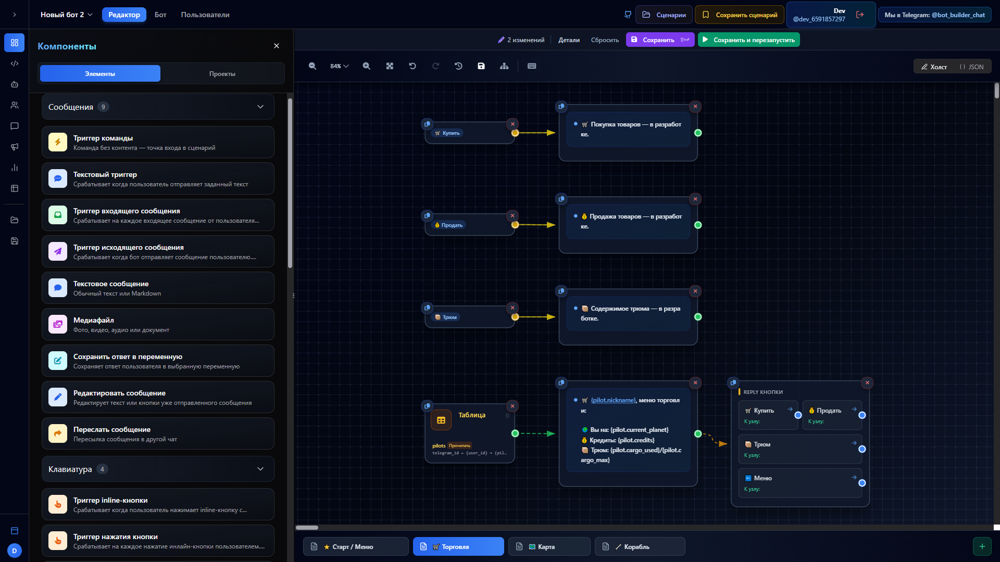

<div align="center">

  [🇷🇺 Русский](README.md) | **🇬🇧 English**

  <picture>
    <source media="(prefers-color-scheme: dark)" srcset="assets/images/bot_added_ui_visible.png">
    <source media="(prefers-color-scheme: light)" srcset="assets/images/bot_added_ui_visible.png">
    
  </picture>

  <h1>🤖 Telegram Bot Builder</h1>

  **Build Telegram bots without coding!**

  [](https://choosealicense.com/licenses/mit/)
  [](https://nodejs.org/)
  [](https://www.typescriptlang.org/)
  [](https://reactjs.org/)
  [](https://www.postgresql.org/)

  <p><strong>A visual drag-and-drop constructor where you build bot logic on a canvas and get a working Python bot automatically.</strong></p>

  > 💡 Perfect for small businesses, freelancers, and anyone who wants to launch a bot quickly without learning to code.

</div>

---

## ✨ Key Features

- **Drag & Drop Editor** — build bot scenarios visually on a canvas
- **Code Generation** — automatically generates Python code (aiogram 3.x)
- **One-Click Launch** — start bots directly from the interface
- **Download Code** — export generated `.py` files and run anywhere
- **Multiple Bot Tokens** — manage several bots per project
- **Inline & Reply Keyboards** — buttons with callback handling
- **Media Support** — photos, videos, audio, documents
- **Variables & Conditions** — store data and branch logic
- **HTTP Requests** — integrate with any external API
- **PostgreSQL Queries** — direct database access from bots
- **Group & Forum Support** — triggers for group messages, forum topics
- **Analytics** — usage statistics in real-time
- **Broadcasts** — mass messaging to bot users
- **Dialogs** — view bot conversations live

---

## 🏗️ Architecture

<div align="center">
  
  
  
</div>

| Layer | Stack | Role |
|-------|-------|------|
| **Frontend** | React + TypeScript | Visual editor, drag & drop |
| **Backend** | Express.js + Node.js | REST API, code generation |
| **Database** | PostgreSQL + Drizzle ORM | Projects, schemas, users |
| **Cache** | Redis (Memurai on Windows) | Sessions, pub/sub events |
| **Bots** | Python + aiogram | Generated bot processes |

---

## 🚀 Quick Start

### Docker (recommended)

```bash
git clone https://github.com/fedorabakumets/telegram-bot-builder.git
cd telegram-bot-builder
docker compose up -d
```

App available at: `http://localhost:5000`

### Manual Installation

**Requirements:** Node.js ≥ 18, PostgreSQL ≥ 17, Redis ≥ 7, Python ≥ 3.10, Git

Full installation guide: **[docs/development/INSTALLATION.md](docs/development/INSTALLATION.md)**

```bash
git clone https://github.com/fedorabakumets/telegram-bot-builder.git
cd telegram-bot-builder
npm install
pip install -r requirements.txt
cp .env.example .env
# Edit .env with your database credentials
npm run dev
```

---

## 🤖 How It Works

1. **User** builds a bot scenario in the visual editor
2. **Frontend** sends changes via REST API
3. **API Server** validates and saves to PostgreSQL
4. **Generator** converts the schema to Python code (aiogram)
5. **Launch** — bot runs as a Python process (Worker Pool)
6. **Telegram** receives messages via polling (default) or webhook
7. **Analytics** collects usage stats in real-time

---

## 📦 Deploying Your Bot

### From the constructor (main way)

Click "Start" in the Bot tab — the server generates code and launches the bot automatically.

### Download and run separately

From the "Code" tab, download the `.py` file and run independently:

```bash
pip install -r requirements.txt
python bot.py
```

### Cloud hosting

| Platform | Docs |
|----------|------|
| **Railway** | [RAILWAY_DEPLOY.md](docs/deployment/RAILWAY_DEPLOY.md) |
| **Docker** | `docker compose up -d` |
| **Any VPS** | Standard Python deployment |

---

## 📋 System Requirements

| Component | Minimum | Recommended |
|-----------|---------|-------------|
| Node.js | 18.0 | 22.0+ LTS |
| PostgreSQL | 17 | 17.10+ |
| Redis | 7.0 | 7.2+ (Memurai on Windows) |
| Python | 3.10 | 3.13+ |
| RAM | 1 GB | 2+ GB |
| Disk | 500 MB | 1+ GB SSD |

---

## 🤝 Contributing

Want to contribute? Join our [Telegram chat](https://t.me/bot_builder_chat) to discuss tasks and directions.

See [CONTRIBUTING.md](docs/development/CONTRIBUTING.md) for details.

---

## 📞 Contact

<div align="center">

[](https://t.me/bot_builder_chat)
[](https://t.me/botcraft_studio)
[](https://github.com/fedorabakumets/telegram-bot-builder/issues)

</div>

---

## 📄 License

MIT License — free for personal and commercial use.
