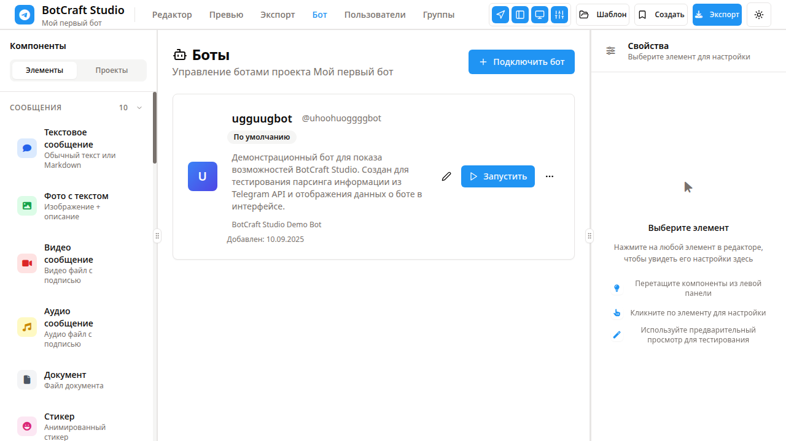
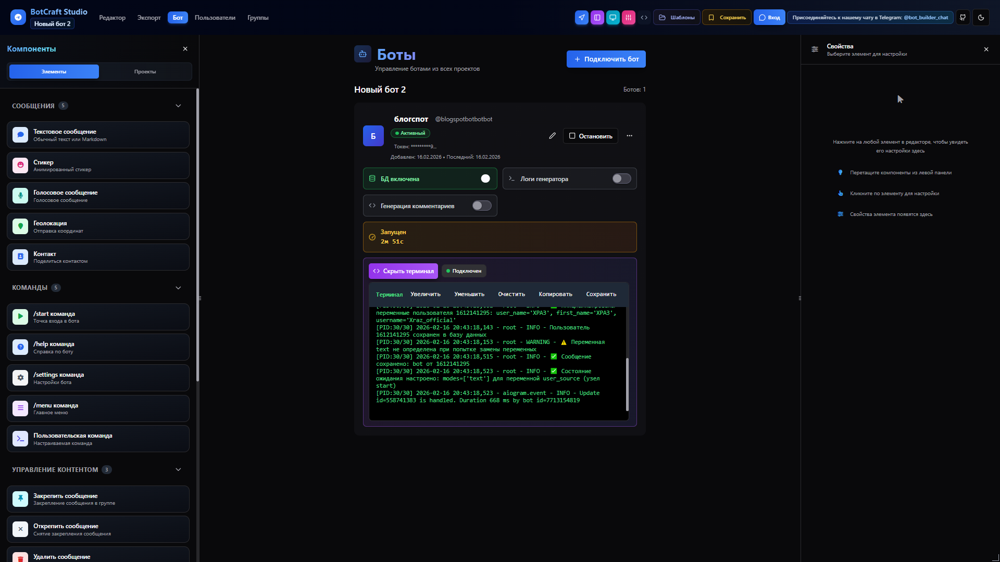

<div align="center">
  <picture>
    <source media="(prefers-color-scheme: dark)" srcset="assets/images/bot_added_ui_visible.png">
    <source media="(prefers-color-scheme: light)" srcset="assets/images/bot_added_ui_visible.png">
    
  </picture>
  
  <h1>
    
  </h1>
  
  **Создавайте Telegram ботов без программирования!**
  
  [](https://choosealicense.com/licenses/mit/)
  [](https://nodejs.org/)
  [](https://www.typescriptlang.org/)
  [](https://reactjs.org/)
  [](https://www.postgresql.org/)
  
  
  
  
  
  
  <!-- Живая статистика -->
  <div>
    
    
  </div>
  
</div>

---

<div align="center">
  <p><strong>Визуальный конструктор с drag-and-drop интерфейсом, где вы просто перетаскиваете блоки на холст, а готовый бот появляется сам.</strong></p>
  
  > 💡 Идеально подходит для малого бизнеса, фрилансеров и тех, кто хочет быстро запустить бота, не изучая программирование.
  
  <!-- Кнопки призыва к действию -->
  <div style="margin: 20px 0;">
    <a href="#-быстрый-старт-5-минут">
      
    </a>
    <a href="#-демонстрация">
      
    </a>
    <a href="#-документация">
      
    </a>
  </div>
  
  <!-- Связь с нами -->
  <div style="margin: 20px 0;">
    <h3>📞 Связь с нами</h3>
    <a href="https://github.com/fedorabakumets/telegram-bot-builder/issues">
      
    </a>
    <a href="https://github.com/fedorabakumets/telegram-bot-builder/discussions">
      
    </a>
    <a href="https://t.me/telegram_bot_builder_chat">
      
    </a>
    <a href="https://discord.gg/your-invite">
      
    </a>
  </div>
</div>

---

## 📸 Демонстрация

### 🎬 Как это работает
<div align="center">
  
  <p><em>Процесс создания бота: от идеи до готового продукта</em></p>
</div>

### 🏗️ Архитектура системы

Система состоит из нескольких основных компонентов:

**🎨 Frontend (React)** - визуальный редактор для создания ботов
- Drag-and-drop интерфейс
- Панель настроек блоков
- Управление проектами

**🖥️ Backend (Express.js)** - API сервер
- REST API для работы с данными
- Генерация Python кода ботов
- Загрузка медиафайлов

**🗄️ База данных (PostgreSQL)** - хранение данных
- Проекты и схемы ботов
- Пользователи и настройки
- Медиафайлы

**☁️ Деплой** - запуск ботов в облаке
- Railway, Vercel
- Автоматическая генерация кода
- Готовые Python боты

#### 📁 Структура проекта

```
telegram-bot-builder/
├── 📱 client/                    # React приложение
│   ├── src/components/editor/    # Визуальный редактор
│   ├── src/lib/bot-generator.ts  # 🔴 Генерация Python кода
│   └── src/pages/               # Страницы интерфейса
├── 🖥️ server/                   # Express сервер
│   ├── routes.ts                # API маршруты
│   ├── telegram-client.ts       # Управление ботами
│   └── storage.ts               # Работа с БД
├── 🗄️ shared/schema.ts          # Типы данных (Drizzle ORM)
├── 🤖 bots/                     # Сгенерированные Python боты
└── 📚 docs/                     # Документация
```


#### 📡 API Endpoints

<details>
<summary><strong>🔗 Основные API маршруты</strong> (нажми для раскрытия)</summary>

**Проекты:**
- `GET /api/projects` - Список проектов пользователя
- `POST /api/projects` - Создать новый проект
- `PUT /api/projects/{id}` - Обновить проект
- `DELETE /api/projects/{id}` - Удалить проект

**Узлы (блоки бота):**
- `GET /api/projects/{id}/nodes` - Получить схему бота
- `POST /api/projects/{id}/nodes` - Добавить узел
- `PUT /api/projects/{id}/nodes/{nodeId}` - Обновить узел
- `DELETE /api/projects/{id}/nodes/{nodeId}` - Удалить узел

**Боты:**
- `POST /api/bots/{id}/generate` - Сгенерировать Python код
- `POST /api/bots/{id}/deploy` - Задеплоить бота
- `GET /api/bots/{id}/status` - Статус бота
- `POST /api/bots/{id}/stop` - Остановить бота

**Медиафайлы:**
- `POST /api/media/upload` - Загрузить файл
- `GET /api/media/{id}` - Скачать файл
- `DELETE /api/media/{id}` - Удалить файл

**Статистика:**
- `GET /api/bots/{id}/stats` - Статистика использования
- `GET /api/bots/{id}/users` - Пользователи бота
- `GET /api/bots/{id}/messages` - История сообщений

</details>

#### 🔄 Поток данных

1. **👤 Пользователь** создает схему бота в визуальном редакторе
2. **🎨 Frontend** отправляет изменения через WebSocket для реального времени
3. **📡 API Server** валидирует данные и сохраняет в PostgreSQL
4. **🤖 Generator** преобразует схему в Python код с aiogram
5. **☁️ Deployment** автоматически деплоит на Railway/Vercel
6. **📱 Telegram** получает webhook и начинает обрабатывать сообщения
7. **📊 Analytics** собирает статистику использования в реальном времени

</details>

---

## ✨ Что это может делать?

<details>
<summary><strong>Развернуть возможности</strong> (нажми чтобы раскрыть)</summary>

<div align="center">
  <table>
    <tr>
      <td align="center" width="33%" style="background: linear-gradient(135deg, #667eea 0%, #764ba2 100%); padding: 20px; border-radius: 10px;">
        <h3>🎨 Визуальный редактор</h3>
        <p>Drag-and-drop интерфейс<br/>Никакого кода!</p>
      </td>
      <td align="center" width="33%" style="background: linear-gradient(135deg, #f093fb 0%, #f5576c 100%); padding: 20px; border-radius: 10px;">
        <h3>🤖 Готовые боты</h3>
        <p>Python код генерируется<br/>автоматически</p>
      </td>
      <td align="center" width="33%" style="background: linear-gradient(135deg, #4facfe 0%, #00f2fe 100%); padding: 20px; border-radius: 10px;">
        <h3>☁️ Облачный деплой</h3>
        <p>Railway, Vercel, VPS<br/>Один клик - бот в продакшене</p>
      </td>
    </tr>
  </table>
</div>

### 🎯 Основные возможности

- **🎨 Создавайте боты перетаскиванием** - никакого кода, просто перемещайте блоки мышкой
- **💬 Отправляйте сообщения** - с форматированием, кнопками и медиафайлами
- **🎨 Красивые интерфейсы** - встроенные и обычные клавиатуры
- **📁 Работа с медиа** - фото, видео, аудио, документы
- **📝 Сбор данных** - формы для сбора информации от пользователей
- **🧠 Логика и условия** - "если произошло то-то, то сделай это"
- **👥 База пользователей** - автоматически собирает информацию о пользователях
- **📊 Статистика** - смотрите, кто написал боту, какие команды использует
- **🎭 Светлая и темная темы** - удобно работать днем и ночью
- **📱 Работает на мобильных телефонах** - создавайте ботов с планшета или смартфона, интерфейс адаптирован для всех устройств

</details>

---

## 🚀 Быстрый старт (5 минут)

<div align="center">
  
  
</div>

<details>
<summary>🖥️ <strong>Локальная установка (рекомендуется)</strong> - нажмите для раскрытия</summary>

### Что нужно:
- **Node.js** (скачать с [nodejs.org](https://nodejs.org))
- **PostgreSQL** (база данных, скачать с [postgresql.org](https://www.postgresql.org/download/))

### Установка:

```bash
# Скопируйте проект
git clone https://github.com/fedorabakumets/telegram-bot-builder.git
cd telegram-bot-builder

# Установите нужные файлы
npm install

# Запустите приложение
npm run dev
```

Если возникает ошибка подключения к базе данных, смотрите подробное руководство по устранению неполадок в файле [docs/development/TROUBLESHOOTING_RU.md](docs/development/TROUBLESHOOTING_RU.md).

**Откройте в браузере:** http://localhost:5000

</details>

<details>
<summary>☁️ Альтернативные способы</summary>

### Replit (для быстрого тестирования):
1. Откройте проект на Replit
2. Нажмите "Run" - приложение запустится автоматически
3. В браузере откроется конструктор бота
4. Начните создавать своего первого бота!

### Docker (для продвинутых):
```bash
# Запуск через Docker
docker build -t telegram-bot-builder .
docker run -p 5000:5000 telegram-bot-builder
```

</details>

---

## ☁️ Деплой в облако

### Railway (рекомендуется)

1. Зарегистрируйтесь на [Railway.app](https://railway.app/)
2. Создайте новый проект
3. Подключите репозиторий с кодом
5. Добавьте переменные окружения (см. [docs/deployment/RAILWAY_DEPLOY.md](docs/deployment/RAILWAY_DEPLOY.md))
6. Создайте PostgreSQL базу данных
7. Запустите миграции базы данных

Подробные инструкции по деплою на Railway смотрите в файле [docs/deployment/RAILWAY_DEPLOY.md](docs/deployment/RAILWAY_DEPLOY.md).

---

## 🎓 Как создать своего первого бота?

<details>
<summary><strong>Пошаговое руководство</strong> (нажми для раскрытия)</summary>

### Шаг 1: Получите токен для бота
1. Откройте Telegram и найдите [@BotFather](https://t.me/BotFather)
2. Напишите `/newbot` и следуйте инструкциям
3. Вы получите токен вроде: `123456789:ABCdef...`

### Шаг 2: Откройте редактор
- При первом запуске у вас уже есть **проект по умолчанию** с узлом "Старт"
- Если нужен новый проект, откройте вкладку **"Проекты"** (слева) и нажмите кнопку **"+ Новый"**

### Шаг 3: Добавьте токен бота
1. В правой части нажмите кнопку **"Бот"** 
2. Вставьте токен, который вы получили от BotFather
3. Токен сохранится автоматически

### Шаг 4: Постройте сценарий бота
1. Перетащите блок **"Сообщение"** на холст рядом с узлом "Старт"
2. Напишите текст, который бот должен отправить
3. В настройках блока укажите, что будет дальше:
   - **Кнопки** - для выбора вариантов ответа
   - **Автопереход** - перейти к другому блоку автоматически
   - **Ожидание ввода** - дождаться сообщения от пользователя
4. Добавьте еще блоки и настройте переходы между ними

### Шаг 5: Запустите бота
1. Откройте вкладку **"Бот"** (справа внизу)
2. Нажмите кнопку **"Запустить"**
3. Откройте своего бота в Telegram
4. Тестируйте и улучшайте!

</details>

---

## 🧩 Типы блоков

<details>
<summary><strong>Элементы для построения</strong> (нажми для раскрытия)</summary>

### 📨 Сообщения и контент

| Блок | Что он делает |
|------|---------------|
| **💬 Текстовое сообщение** | Отправляет текст пользователю (можно добавить медиафайлы) |
| **🎭 Стикер** | Отправляет анимированный стикер |
| **🎤 Голосовое сообщение** | Отправляет голосовое сообщение |
| **📍 Геолокация** | Отправляет карту с координатами |
| **📇 Контакт** | Поделиться контактом |

### 📦 Медиафайлы в сообщениях

В свойствах каждого **текстового сообщения** вы можете загрузить и прикрепить:

- **📸 Фотографии** - изображения в формате JPG, PNG
- **🎬 Видео** - видеоролики
- **🎵 Аудио файлы** - музыка и голосовые записи
- **📄 Документы** - файлы PDF, Word, Excel и другие
- **🎤 Аудиосообщения** - голосовые сообщения от пользователя

**Или используйте отдельный блок:**
- **🎤 Голосовое сообщение** - специальный блок для отправки чистых аудио сообщений

**Как использовать:**
1. Выберите блок "Текстовое сообщение"
2. В панели свойств (справа) найдите раздел с медиафайлами
3. Загрузите файл со своего компьютера
4. Бот будет отправлять его вместе с текстом!

### ⚙️ Команды (можно добавлять свои!)

Встроенные команды: **/start**, **/help**, **/settings**, **/menu**

**Важно:** Вы можете добавить любые свои команды! Например:
- `/price` - показать цены
- `/order` - оформить заказ
- `/support` - получить поддержку
- `/about` - информация о компании

### 👥 Управление пользователями

- **Заблокировать пользователя** - запретить участию в группе
- **Разблокировать** - снять блокировку с участника
- **Заглушить пользователя** - ограничить право голоса участника
- **Снять ограничения** - восстановить права участника
- **Исключить пользователя** - удалить участника из группы

### 📝 Управление контентом

- **Закрепить сообщение** - закрепить сообщение в группе
- **Открыть сообщение** - опубликовать сообщение в группе
- **Удалить сообщение** - удалить сообщение из группы

### 👫 Управление группами

На вкладке **"Группы"** вы (администратор) можете управлять группами, в которых работает ваш бот:

**Основные функции:**
- **Просмотр групп** - список всех групп, в которых подключен ваш бот
- **Добавить участников** - приглашать пользователей в существующую группу
- **Посмотреть членов** - список всех участников группы
- **Настройки группы** - изменить название, описание, права доступа для группы

**Что можно настроить в группе:**
- � **Урправление участниками** - добавлять/удалять людей в группу
- � **Праваа доступа** - кто может писать сообщения, кто может менять настройки
- 📋 **Описание группы** - информация о группе для участников
- ⚙️ **Параметры** - различные настройки для работы группы

**Что может делать бот в группе:**
Все команды управления пользователями и контентом работают для всей группы. Бот может:
- Отправлять сообщения всей группе одновременно
- Управлять участниками по правилам, которые вы установили
- Закреплять важные сообщения для всех видеть
- Удалять спам или неуместные сообщения
- Обрабатывать команды, введенные пользователями в группе

### 🔄 Логика переходов

Настраивается в свойствах каждого блока:
- **Кнопки** - пользователь выбирает один из вариантов, и бот переходит на нужное сообщение
- **Ожидание ввода** - бот ждет ответ от пользователя, затем переходит на следующее сообщение
- **Автопереход** - переход к следующему блоку автоматически без ожидания
- **Условные переходы** - "если произошло то-то, то на другое сообщение..." (указывается в свойствах)

</details>

---

## 📚 Пример: Простой бот для пиццерии

### 💻 Визуальная схема бота

```
🚀 Старт
    ↓
💬 "Добро пожаловать! Выберите пиццу 🍕"
    ↓
🍕 Выбор пиццы (кнопки)
    ├── Маргарита ────┐
    ├── Пепперони ────┤
    └── Вегетарианская ┘
                      ↓
📝 "Введите ваш адрес доставки"
    ↓
✅ Подтверждение заказа
    ↓
🚗 "Спасибо за заказ! Ожидайте доставку"
```

### 🔧 Пошаговое создание:

1. **Старт** → "Добро пожаловать! Выберите пиццу 🍕"
2. **Добавьте кнопки** → ["Маргарита", "Пепперони", "Вегетарианская"]
3. **Сообщение с ожиданием** → "Введите ваш адрес доставки"
4. **Финальное сообщение** → "Спасибо за заказ! Ожидайте доставку 🚗"

### 💻 Сгенерированный код

<details>
<summary>🐍 <strong>Посмотреть автоматически созданный Python код</strong> (нажми чтобы раскрыть)</summary>

```python
# 🤖 Автоматически сгенерированный бот для пиццерии
import asyncio
from aiogram import Bot, Dispatcher, types
from aiogram.filters import Command
from aiogram.types import ReplyKeyboardMarkup, KeyboardButton

bot = Bot(token="YOUR_BOT_TOKEN")
dp = Dispatcher()

def get_pizza_keyboard():
    keyboard = ReplyKeyboardMarkup(
        keyboard=[
            [KeyboardButton(text="🍕 Маргарита")],
            [KeyboardButton(text="🍕 Пепперони")], 
            [KeyboardButton(text="🥬 Вегетарианская")]
        ],
        resize_keyboard=True
    )
    return keyboard

@dp.message(Command("start"))
async def start_handler(message: types.Message):
    await message.answer(
        "🍕 Добро пожаловать в пиццерию!\nВыберите пиццу:",
        reply_markup=get_pizza_keyboard()
    )

@dp.message(lambda message: "🍕" in message.text or "🥬" in message.text)
async def pizza_selected(message: types.Message):
    pizza_type = message.text
    await message.answer(
        f"Отличный выбор: {pizza_type}!\n📍 Введите ваш адрес доставки:",
        reply_markup=types.ReplyKeyboardRemove()
    )

# Запуск бота
async def main():
    await dp.start_polling(bot)

if __name__ == "__main__":
    asyncio.run(main())
```

</details>

**Результат:** Бот готов принимать заказы без единой строки кода!

---

## 🎯 Для кого это подходит?

<details>
<summary><strong>Целевая аудитория</strong> (нажми для раскрытия)</summary>

<div align="center">

<table>
<tr>
<td align="center" width="25%">

### 🏪 Малый бизнес
Пиццерии, салоны,<br/>
магазины, кафе

</td>
<td align="center" width="25%">

### 💼 Фрилансеры
Создание ботов<br/>
для клиентов

</td>
<td align="center" width="25%">

### 🚀 Стартапы
Быстрое MVP<br/>
без разработчиков

</td>
<td align="center" width="25%">

### 🎓 Обучение
Изучение логики<br/>
ботов без кода

</td>
</tr>
</table>

</div>

</details>

---


## 🛠️ Технические детали

<details>
<summary><strong>Для разработчиков</strong> (нажми для раскрытия)</summary>

### Структура проекта

```
telegram-bot-builder/
├── 📱 Frontend (React приложение)
│   ├── client/                      # React frontend
│   │   └── src/
│   │       ├── components/          # UI компоненты
│   │       │   ├── ui/              # Базовые компоненты (кнопки, формы, диалоги)
│   │       │   ├── editor/          # Компоненты редактора (холст, панель свойств)
│   │       │   ├── layout/          # Компоненты макета
│   │       │   └── media/           # Компоненты для работы с медиафайлами
│   │       ├── pages/               # Страницы приложения
│   │       ├── lib/                 # Утилиты и логика генерации
│   │       │   ├── bot-generator.ts # 🔴 Основная генерация Python кода
│   │       │   ├── commands.ts      # Команды и утилиты
│   │       │   └── utils.ts         # Общие утилиты
│   │       ├── hooks/               # React хуки
│   │       ├── App.tsx              # Главный компонент приложения
│   │       └── index.tsx            # Точка входа React
│   └── src/                         # Дополнительные исходники
│
├── 🖥️ Backend (Express сервер)
│   ├── server/                      # Express backend
│   │   ├── index.ts                 # Точка входа сервера
│   │   ├── routes.ts                # API маршруты
│   │   ├── db.ts                    # Подключение к PostgreSQL
│   │   ├── telegram-client.ts       # Управление Telegram ботами
│   │   ├── telegram-media.ts        # Работа с медиафайлами
│   │   ├── storage.ts               # Интерфейс для работы с БД
│   │   └── cache.ts                 # Система кеширования
│   ├── shared/                      # Общие типы и схемы
│   │   └── schema.ts                # Drizzle ORM схемы
│   └── api/                         # API эндпоинты
│       └── index.ts                 # Vercel API handler
│
├── 🗄️ База данных
│   └── migrations/                  # Миграции PostgreSQL
│       └── *.sql                    # SQL файлы миграций
│
├── 🤖 Генерируемые боты
│   └── bots/                        # Сгенерированные Python боты
│       └── *.py                     # Готовые боты для запуска
│
├── 📁 Ресурсы и данные
│   ├── uploads/                     # Загруженные медиафайлы
│   ├── assets/                      # Статические ресурсы
│   │   └── images/                  # Изображения и скриншоты
│   └── backups/                     # Резервные копии
│
├── 🛠️ Скрипты и утилиты
│   ├── scripts/                     # Утилиты проекта
│   │   ├── setup/                   # Скрипты настройки
│   │   │   ├── setup.bat            # Основная настройка
│   │   │   └── create-env.bat       # Создание .env файла
│   │   ├── utils/                   # Вспомогательные утилиты
│   │   │   ├── update-project.js    # Обновление проекта
│   │   │   ├── validate.py          # Валидация данных
│   │   │   └── sync-to-github.sh    # Синхронизация с GitHub
│   │   ├── start-dev.bat            # Запуск разработки
│   │   ├── start-prod.bat           # Запуск продакшена
│   │   ├── init-db.ts               # Инициализация БД
│   │   └── migrate.ts               # Применение миграций
│
├── 📚 Документация
│   ├── docs/                        # Структурированная документация
│   │   ├── development/             # Документация для разработчиков
│   │   │   ├── SETUP.md             # Руководство по настройке
│   │   │   ├── TROUBLESHOOTING_RU.md # Устранение неполадок
│   │   │   ├── CONTRIBUTING.md      # Руководство для контрибьюторов
│   │   │   └── REQUIREMENTS_SPECIFICATION.md # Спецификация
│   │   ├── deployment/              # Документация по деплою
│   │   │   ├── VERCEL_DEPLOY.md     # Развертывание на Vercel
│   │   │   ├── RAILWAY_DEPLOY.md    # Развертывание на Railway
│   │   │   └── replit.md            # Настройка в Replit
│   │   ├── analysis/                # Анализ проекта
│   │   │   ├── PROJECT_STRUCTURE_ANALYSIS.md # Анализ структуры
│   │   │   └── INFRASTRUCTURE_ANALYSIS.md    # Анализ инфраструктуры
│   │   ├── SECURITY.md              # Руководство по безопасности
│   │   └── README.md                # Индекс документации
│
├── ⚙️ Конфигурация
│   ├── drizzle.config.ts            # Конфигурация Drizzle ORM
│   ├── vite.config.ts               # Конфигурация Vite
│   ├── tailwind.config.ts           # Конфигурация Tailwind CSS
│   ├── tsconfig.json                # Конфигурация TypeScript
│   ├── components.json              # Конфигурация Shadcn компонентов
│   ├── package.json                 # Зависимости и скрипты npm
│   └── Dockerfile                   # Конфигурация Docker
│
└── 📄 Основные файлы
    ├── README.md                    # Этот файл с документацией
    ├── LICENSE                      # Лицензия MIT
    └── .env.example                 # Пример файла окружения
```

### Используемые технологии

**Frontend:**
- **React 18** - основной фреймворк интерфейса
- **TypeScript** - типизированный JavaScript для надежности
- **Vite** - быстрая сборка приложения
- **Tailwind CSS** - система стилей
- **Shadcn/ui** - готовые компоненты UI

**Backend:**
- **Node.js** с **Express.js** - сервер приложения
- **TypeScript** (ES modules) - типизированный код
- **PostgreSQL** - база данных
- **Drizzle ORM** - работа с БД
- **WebSocket** - реальное обновление

**Генерируемые боты используют:**
- **Python 3.11+** - язык программирования
- **aiogram 3.x** - библиотека для Telegram ботов
- **asyncpg** - асинхронная работа с PostgreSQL
- **aiohttp** - HTTP запросы

### 📦 Архив функций

В проекте есть архив с дополнительными функциями, которые не используются в основном коде:
- **server/routes/** - дополнительные API маршруты
- **bots/\*.py.backup** - старые версии сгенерированных ботов

Эти функции находятся в архиве и могут быть активированы при необходимости разработчиками.

### 👨‍💻 Для разработчиков

**Как расширить функциональность:**
1. Новые типы узлов добавляются в **shared/schema.ts** (типы Node)
2. Логика генерации кода в **client/src/lib/bot-generator.ts**
3. Новые API эндпоинты в **server/routes.ts**
4. UI компоненты в **client/src/components/editor/**

**Ключевые файлы:**
- **bot-generator.ts** - основной генератор Python кода, содержит все преобразования от визуального редактора к коду
- **properties-panel.tsx** - панель свойств для редактирования узлов (в client/src/components/editor/)
- **telegram-client.ts** - управление подключением к Telegram API

**Полезные команды:**
```bash
npm run dev          # Запустить приложение
npm run check        # Проверить TypeScript ошибки
npm run db:push      # Применить миграции БД

# Скрипты настройки
scripts/setup/setup.bat        # Основная настройка проекта
scripts/start-dev.bat          # Запуск разработки
scripts/start-prod.bat         # Запуск продакшена
```

**Документация:**
- � **ПНолная документация** → [docs/README.md](docs/README.md)
- �️ **Нпастройка проекта** → [docs/development/SETUP.md](docs/development/SETUP.md)
- � ***Деплой** → [docs/deployment/](docs/deployment/)
- 🔍 **Анализ проекта** → [docs/analysis/](docs/analysis/)

### 🤖 Для AI-ассистентов

При запросах на модификацию кода:
1. Всегда начните с **shared/schema.ts** - типы данных определяют всю архитектуру
2. Frontend логика в **client/src/** использует React Query для состояния
3. Backend маршруты в **server/routes.ts** тонкие, основная логика в storage
4. Генерация кода в **bot-generator.ts** - самый большой файл, используйте поиск по функциям
5. Проверяйте **docs/deployment/replit.md** перед изменениями - там описаны архитектурные решения

**Полезные команды:**
```bash
npm run dev          # Запустить приложение
npm run check        # Проверить TypeScript ошибки
npm run db:push      # Применить миграции БД
```

</details>

---

## 📚 Документация

Вся документация проекта организована в папке `docs/` и разделена по категориям:

### 🛠️ Для разработчиков
- **[Настройка проекта](docs/development/SETUP.md)** - пошаговое руководство по установке
- **[Устранение неполадок](docs/development/TROUBLESHOOTING_RU.md)** - решение частых проблем
- **[Руководство для контрибьюторов](docs/development/CONTRIBUTING.md)** - как участвовать в разработке
- **[Спецификация требований](docs/development/REQUIREMENTS_SPECIFICATION.md)** - техническое описание

### 🚀 Деплой и развертывание
- **[Railway](docs/deployment/RAILWAY_DEPLOY.md)** - развертывание на Railway (рекомендуется)
- **[Vercel](docs/deployment/VERCEL_DEPLOY.md)** - развертывание на Vercel
- **[Replit](docs/deployment/replit.md)** - настройка в Replit

### 📊 Анализ проекта
- **[Структура проекта](docs/analysis/PROJECT_STRUCTURE_ANALYSIS.md)** - детальный анализ архитектуры
- **[Анализ инфраструктуры](docs/analysis/INFRASTRUCTURE_ANALYSIS.md)** - технические решения

### 🔒 Безопасность
- **[Руководство по безопасности](docs/SECURITY.md)** - лучшие практики безопасности

**📖 Полный индекс документации:** [docs/README.md](docs/README.md)

---

## 🛠️ Скрипты и утилиты

Проект включает набор скриптов для автоматизации задач разработки:

### Быстрый запуск
```bash
# Windows
scripts/start-dev.bat      # Запуск в режиме разработки
scripts/start-prod.bat     # Запуск в продакшене

# Настройка проекта
scripts/setup/setup.bat    # Основная настройка
scripts/setup/create-env.bat # Создание .env файла
```

### Утилиты разработки
- **Обновление проекта** - `scripts/utils/update-project.js`
- **Валидация данных** - `scripts/utils/validate.py`
- **Синхронизация с GitHub** - `scripts/utils/sync-to-github.sh`

**📖 Полная документация скриптов:** [scripts/README.md](scripts/README.md)

---

## 🐛 Что-то не работает?

### База данных не подключается
```bash
# Убедитесь что PostgreSQL запущен
# Проверьте строку подключения в .env файле
```

Подробное руководство по устранению неполадок с подключением к базе данных смотрите в файле [docs/development/TROUBLESHOOTING_RU.md](docs/development/TROUBLESHOOTING_RU.md).

### Порт 5000 занят
```bash
# Измените порт в коде или завершите процесс на этом порту
```

### Ошибка при установке
1. Удалите папку `node_modules`
2. Выполните `npm install` заново
3. Попробуйте снова

---

## 📋 Системные требования

<details>
<summary><strong>Технические требования</strong> (нажми для раскрытия)</summary>

<div align="center">

<table>
<tr>
<th>💻 Компонент</th>
<th>⚡ Минимум</th>
<th>🚀 Рекомендуемо</th>
<th>🎯 Оптимально</th>
</tr>
<tr>
<td><strong>Node.js</strong></td>
<td>18.0</td>
<td>20.0+</td>
<td>22.0+ LTS</td>
</tr>
<tr>
<td><strong>PostgreSQL</strong></td>
<td>13</td>
<td>15+</td>
<td>16+ Latest</td>
</tr>
<tr>
<td><strong>Python</strong></td>
<td>3.11</td>
<td>3.12+</td>
<td>3.13+ Latest</td>
</tr>
<tr>
<td><strong>RAM</strong></td>
<td>1 GB</td>
<td>2+ GB</td>
<td>4+ GB</td>
</tr>
<tr>
<td><strong>Диск</strong></td>
<td>500 MB</td>
<td>1+ GB</td>
<td>2+ GB SSD</td>
</tr>
</table>

### 🖥️ Поддерживаемые ОС


</div>

</details>

---

## 🚀 Развертывание готового бота

После создания бота, приложение генерирует Python файл. Вы можете:

1. **Скачать** готовый код
2. **Запустить локально** на своем компьютере:
   - На Windows, Mac или Linux
   - Просто установите Python и запустите файл
   - Идеально для тестирования перед публикацией
3. **Развернуть** на хостинге для постоянной работы:
   - **Railway** - современная платформа для деплоя
   - **VPS** (DigitalOcean, Linode, AWS) - полный контроль
   - **Cloud Run** - от Google для больших нагрузок
4. **Модифицировать** если нужна специальная логика

Подробные инструкции по деплою на Railway смотрите в файле [docs/deployment/RAILWAY_DEPLOY.md](docs/deployment/RAILWAY_DEPLOY.md).

---

## 📄 Лицензия

MIT License - используйте свободно для личных и коммерческих целей.

---

## 🤝 Помощь и поддержка

<div align="center">

### 🆘 Быстрая помощь
<table>
<tr>
<td align="center" width="25%">
<h4>🐛 Нашли баг?</h4>
<a href="https://github.com/fedorabakumets/telegram-bot-builder/issues/new">

</a>
</td>
<td align="center" width="25%">
<h4>💡 Есть идея?</h4>
<a href="https://github.com/fedorabakumets/telegram-bot-builder/discussions">

</a>
</td>
<td align="center" width="25%">
<h4>📖 Нужна помощь?</h4>
<a href="docs/README.md">

</a>
</td>
<td align="center" width="25%">
<h4>🤝 Хотите помочь?</h4>
<a href="docs/development/CONTRIBUTING.md">

</a>
</td>
</tr>
</table>

</div>

---
