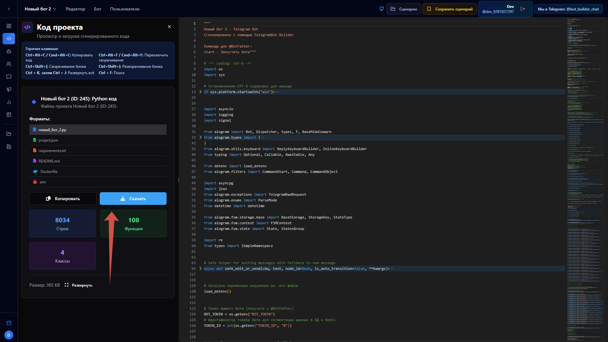

<div align="center">
  <picture>
    <source media="(prefers-color-scheme: dark)" srcset="https://raw.githubusercontent.com/fedorabakumets/telegram-bot-builder/main/assets/images/bot_added_ui_visible.png?v=2">
    <source media="(prefers-color-scheme: light)" srcset="https://raw.githubusercontent.com/fedorabakumets/telegram-bot-builder/main/assets/images/bot_added_ui_visible.png?v=2">
    
  </picture>
  
  <h1>
    
  </h1>
  
  **Создавайте Telegram ботов без программирования!**
  
  [](https://choosealicense.com/licenses/mit/)
  [](https://nodejs.org/)
  [](https://www.typescriptlang.org/)
  [](https://reactjs.org/)
  [](https://www.postgresql.org/)
  
  
  
  
  
  
  <!-- Живая статистика -->
  
</div>


<div align="center">
  <p><strong>Визуальный конструктор с drag-and-drop интерфейсом, где вы просто перетаскиваете блоки на холст, а готовый бот появляется сам.</strong></p>
  
  > 💡 Идеально подходит для малого бизнеса, фрилансеров и тех, кто хочет быстро запустить бота, не изучая программирование.
  

  <!-- Связь с нами -->
  <div style="margin: 20px 0;">
    <h3>📞 Связь с нами</h3>
    <a href="https://github.com/fedorabakumets/telegram-bot-builder/issues">
      
    </a>
    <a href="https://github.com/fedorabakumets/telegram-bot-builder/discussions">
      
    </a>
    <a href="https://t.me/bot_builder_chat">
      
    </a>
    <a href="https://t.me/botcraft_studio">
      
    </a>
  </div>
</div>

---


### 🏗️ Архитектура системы

<div align="center">
  
  
  
</div>

<br/>

<div align="center">
  <table>
    <tr>
      <td align="center" width="25%" style="padding: 15px;">
        <div style="background: linear-gradient(135deg, #667eea 0%, #764ba2 100%); padding: 20px; border-radius: 15px; color: white;">
          <h3>🎨 Frontend</h3>
          <p><strong>React + TypeScript</strong></p>
          <p>Визуальный редактор</p>
          <hr style="border: 1px solid rgba(255,255,255,0.3);">
          <small>• Drag-and-drop интерфейс<br/>
          • Панель настроек блоков<br/>
          • Управление проектами</small>
        </div>
      </td>
      <td align="center" width="25%" style="padding: 15px;">
        <div style="background: linear-gradient(135deg, #f093fb 0%, #f5576c 100%); padding: 20px; border-radius: 15px; color: white;">
          <h3>🖥️ Backend</h3>
          <p><strong>Express.js + Node.js</strong></p>
          <p>API сервер</p>
          <hr style="border: 1px solid rgba(255,255,255,0.3);">
          <small>• REST API для данных<br/>
          • Генерация Python кода<br/>
          • Загрузка медиафайлов</small>
        </div>
      </td>
      <td align="center" width="25%" style="padding: 15px;">
        <div style="background: linear-gradient(135deg, #4facfe 0%, #00f2fe 100%); padding: 20px; border-radius: 15px; color: white;">
          <h3>🗄️ База данных</h3>
          <p><strong>PostgreSQL + Drizzle</strong></p>
          <p>Хранение данных</p>
          <hr style="border: 1px solid rgba(255,255,255,0.3);">
          <small>• Проекты и схемы ботов<br/>
          • Пользователи и настройки<br/>
          • Медиафайлы</small>
        </div>
      </td>
      <td align="center" width="25%" style="padding: 15px;">
        <div style="background: linear-gradient(135deg, #fa709a 0%, #fee140 100%); padding: 20px; border-radius: 15px; color: white;">
          <h3>☁️ Деплой</h3>
          <p><strong>Railway + Python</strong></p>
          <p>Запуск ботов</p>
          <hr style="border: 1px solid rgba(255,255,255,0.3);">
          <small>• Автогенерация кода<br/>
          • Готовые Python боты<br/>
          • Облачный хостинг</small>
        </div>
      </td>
    </tr>
  </table>
</div>

#### 🔄 Поток данных

<div align="center">
  
  
  
  
  
  
  
</div>

<div align="center" style="margin: 20px 0;">
  
  
  
  
  
</div>

<details>
<summary><strong>📋 Подробное описание потока</strong> (нажми для раскрытия)</summary>

1. **👤 Пользователь** создает схему бота в визуальном редакторе
2. **🎨 Frontend** отправляет изменения через REST API, предлагает сохранить и перезапустить бота
3. **📡 API Server** валидирует данные и сохраняет в PostgreSQL
4. **🤖 Generator** преобразует схему в Python код с aiogram
5. **▶️ Запуск** — бот запускается как Python-процесс на сервере (Worker Pool)
6. **📱 Telegram** получает сообщения через polling (по умолчанию) или webhook
7. **📊 Analytics** собирает статистику использования в реальном времени

</details>

---

## 📁 Структура проекта

<details>
<summary><strong>Показать структуру проекта</strong></summary>

```
📦 telegram-bot-builder/
┣ 📂 client/                     # 🎨 React Frontend
┃ ┣ 📂 components/               # UI компоненты
┃ ┃ ┣ 📂 editor/                 # Визуальный редактор
┃ ┃ ┃ ┣ 📂 app-sidebar/          # Навигация по вкладкам
┃ ┃ ┃ ┣ 📂 analytics/            # Панель аналитики
┃ ┃ ┃ ┣ 📂 bot/                  # Управление ботами
┃ ┃ ┃ ┣ 📂 broadcast/            # Рассылки
┃ ┃ ┃ ┣ 📂 canvas/               # Холст редактора (drag & drop)
┃ ┃ ┃ ┣ 📂 code/                 # Вкладка «Код бота»
┃ ┃ ┃ ┣ 📂 dialogs/              # Диалоги с пользователями
┃ ┃ ┃ ┣ 📂 properties/           # Панель свойств блоков
┃ ┃ ┃ ┣ 📂 sidebar/              # Панель компонентов
┃ ┃ ┃ ┗ 📂 users/                # Вкладка «Пользователи»
┃ ┃ ┣ 📂 ui/                     # Базовые UI элементы
┃ ┃ ┗ 📂 media/                  # Медиа компоненты
┃ ┣ 📂 hooks/                    # React хуки
┃ ┣ 📂 pages/                    # Страницы приложения
┃ ┣ 📂 storage/                  # Локальное хранилище
┃ ┣ 📂 types/                    # TypeScript типы
┃ ┣ 📂 utils/                    # Утилиты
┃ ┗ 📄 App.tsx                   # Главный компонент
┣ 📂 server/                     # 🖥️ Express Backend
┃ ┣ 📂 auth/                     # Аутентификация
┃ ┣ 📂 bots/                     # Запуск/остановка ботов
┃ ┣ 📂 database/                 # Работа с PostgreSQL
┃ ┣ 📂 files/                    # Работа с файлами
┃ ┣ 📂 handlers/                 # Обработчики запросов
┃ ┣ 📂 middleware/               # Middleware
┃ ┣ 📂 migrations/               # Миграции БД
┃ ┣ 📂 redis/                    # Redis (события, кэш)
┃ ┣ 📂 routes/                   # API маршруты
┃ ┣ 📂 services/                 # Бизнес-логика
┃ ┣ 📂 storages/                 # Хранилища данных
┃ ┣ 📂 telegram/                 # Telegram API клиент
┃ ┣ 📂 templates/                # Шаблоны генерации
┃ ┣ 📂 terminal/                 # Терминал ботов
┃ ┣ 📂 utils/                    # Утилиты сервера
┃ ┗ 📄 index.ts                  # Точка входа сервера
┣ 📂 shared/                     # 🔗 Общие модули (схемы, типы)
┣ 📂 bots/                       # 🤖 Сгенерированные Python-боты
┣ 📂 docs/                       # 📚 Документация
┃ ┣ 📂 analysis/                 # Анализ архитектуры
┃ ┣ 📂 deployment/               # Инструкции по деплою
┃ ┣ 📂 development/              # Для разработчиков
┃ ┣ 📂 features/                 # Описание фич
┃ ┣ 📂 futures/                  # Планы развития
┃ ┗ 📂 releases/                 # Заметки к релизам
┣ 📂 migrations/                 # 🗄️ Миграции Drizzle ORM
┣ 📂 uploads/                    # 📁 Загруженные медиафайлы
┣ 📂 scripts/                    # 📜 Вспомогательные скрипты
┣ 📄 package.json                # 📦 Зависимости Node.js
┣ 📄 tsconfig.json               # ⚙️ Настройки TypeScript
┣ 📄 vite.config.ts              # ⚡ Конфигурация Vite
┣ 📄 drizzle.config.ts           # 🗄️ Настройки Drizzle ORM
┣ 📄 docker-compose.yml          # 🐳 Docker конфигурация
┗ 📄 .env.example                # 🔐 Пример переменных окружения
```

</details>

---

## 📡 API Endpoints

<div align="center">
  
  
  
</div>

<details>
<summary><strong>🔗 Основные API маршруты</strong> (нажми для раскрытия)</summary>

<table>
<tr>
<th>🎯 Категория</th>
<th>📡 Endpoint</th>
<th>📝 Описание</th>
</tr>

<tr>
<td rowspan="4"><strong>📋 Проекты</strong></td>
<td><code>GET /api/projects</code></td>
<td>Список проектов пользователя</td>
</tr>
<tr>
<td><code>POST /api/projects</code></td>
<td>Создать новый проект</td>
</tr>
<tr>
<td><code>PUT /api/projects/{id}</code></td>
<td>Обновить проект</td>
</tr>
<tr>
<td><code>DELETE /api/projects/{id}</code></td>
<td>Удалить проект</td>
</tr>

<tr>
<td rowspan="4"><strong>🧩 Узлы</strong></td>
<td><code>GET /api/projects/{id}/nodes</code></td>
<td>Получить схему бота</td>
</tr>
<tr>
<td><code>POST /api/projects/{id}/nodes</code></td>
<td>Добавить узел</td>
</tr>
<tr>
<td><code>PUT /api/projects/{id}/nodes/{nodeId}</code></td>
<td>Обновить узел</td>
</tr>
<tr>
<td><code>DELETE /api/projects/{id}/nodes/{nodeId}</code></td>
<td>Удалить узел</td>
</tr>

<tr>
<td rowspan="4"><strong>🤖 Боты</strong></td>
<td><code>POST /api/bots/{id}/generate</code></td>
<td>Сгенерировать Python код</td>
</tr>
<tr>
<td><code>POST /api/bots/{id}/deploy</code></td>
<td>Задеплоить бота</td>
</tr>
<tr>
<td><code>GET /api/bots/{id}/status</code></td>
<td>Статус бота</td>
</tr>
<tr>
<td><code>POST /api/bots/{id}/stop</code></td>
<td>Остановить бота</td>
</tr>

<tr>
<td rowspan="3"><strong>📁 Медиа</strong></td>
<td><code>POST /api/media/upload</code></td>
<td>Загрузить файл</td>
</tr>
<tr>
<td><code>GET /api/media/{id}</code></td>
<td>Скачать файл</td>
</tr>
<tr>
<td><code>DELETE /api/media/{id}</code></td>
<td>Удалить файл</td>
</tr>

<tr>
<td rowspan="3"><strong>📊 Статистика</strong></td>
<td><code>GET /api/bots/{id}/stats</code></td>
<td>Статистика использования</td>
</tr>
<tr>
<td><code>GET /api/bots/{id}/users</code></td>
<td>Пользователи бота</td>
</tr>
<tr>
<td><code>GET /api/bots/{id}/messages</code></td>
<td>История сообщений</td>
</tr>
</table>

</details>

---
## 🎯 Основные возможности

### 🎨 Визуальный редактор
- **Drag & Drop** — перетаскивайте блоки на холст, соединяйте стрелками
- **Набор блоков постоянно растёт** — новые ноды добавляются с каждым обновлением
- **Светлая и тёмная темы** — удобно работать днём и ночью
- **Адаптивный интерфейс** — работает на десктопе, планшете и смартфоне

### 💬 Сообщения и триггеры
- **Команды** — /start, /help и любые пользовательские команды
- **Текстовые триггеры** — реакция на конкретные слова или любое сообщение
- **Исходящие сообщения** — триггер на отправку сообщений ботом
- **Медиафайлы** — фото, видео, аудио, документы
- **Сбор данных** — сохранение ответов пользователей в переменные
- **Редактирование и пересылка** — изменение отправленных сообщений, пересылка в другие чаты

### ⌨️ Клавиатуры
- **Inline-кнопки** — с callback-данными и обработкой нажатий
- **Reply-клавиатуры** — обычные кнопки под полем ввода
- **Answer callback query** — ответ на нажатие inline-кнопки

### 👥 Группы и форумы
- **Триггеры на сообщения в группах** — бот реагирует на сообщения участников
- **Создание тем в форумах** — автоматическое создание топиков

### 🔌 Интеграции
- **HTTP-запросы** — обращение к любым внешним API
- **PostgreSQL** — прямые SQL-запросы к базе данных из бота
- **Условная логика** — ветвления "если... то..."
- **Переменные** — хранение и использование данных между шагами
- **Конвертация файлов** — преобразование форматов

### 🖥️ Вкладки конструктора
- **📋 Код бота** — просмотр и скачивание сгенерированного Python-кода
- **🤖 Бот** — управление запуском, токен, статус
- **👥 Пользователи** — база всех, кто писал боту
- **💬 Диалоги** — переписки бота с пользователями в реальном времени
- **📢 Рассылки** — массовая отправка сообщений по базе
- **📊 Аналитика** — статистика использования бота

> 💡 Вкладки и блоки постоянно обновляются и дополняются с каждым релизом.

---

## ☁️ Запуск и деплой бота

### ▶️ Вариант 1: Запуск из конструктора (кнопка «Запустить»)

Бот запускается прямо из интерфейса конструктора:
- **На официальном сайте** — пока работает нестабильно, актуальную ссылку можно получить в чате [@bot_builder_chat](https://t.me/bot_builder_chat). Скоро выпускаем глобально!
- **Self-hosted (рекомендуется)** — разверните конструктор у себя и запускайте ботов из своей инфраструктуры

### 📦 Вариант 2: Скачать код и запустить где угодно

Из конструктора (официальный сайт или self-hosted):
1. Откройте вкладку **«Код бота»**
2. Скачайте сгенерированный `.py` файл
3. Отредактируйте под свои нужды (код полностью ваш, никакого чёрного ящика)
4. Запустите на любом сервере, VPS или домашнем компьютере — независимо от конструктора

### 🖥️ Вариант 3: Self-hosted конструктор

Разверните Bot Builder на своём сервере — и создавайте/запускайте ботов в своей инфраструктуре:

#### Railway (рекомендуется)

1. Зарегистрируйтесь на [Railway.app](https://railway.app/)
2. Создайте новый проект
3. Подключите репозиторий с кодом
4. Добавьте переменные окружения (см. [docs/deployment/RAILWAY_DEPLOY.md](docs/deployment/RAILWAY_DEPLOY.md))
5. Создайте PostgreSQL базу данных
6. Запустите миграции базы данных

Подробные инструкции: [docs/deployment/RAILWAY_DEPLOY.md](docs/deployment/RAILWAY_DEPLOY.md)

#### Docker

```bash
git clone https://github.com/fedorabakumets/telegram-bot-builder.git
cd telegram-bot-builder
docker compose up -d
```

#### Ручная установка (любая ОС)

См. пошаговую инструкцию ниже.

---


## 📜 Пошаговая инструкция

Подробное руководство по установке для Windows, macOS и Linux (Git, Node.js, PostgreSQL, Redis, Python, настройка БД, клонирование, запуск):

👉 **[docs/development/INSTALLATION.md](docs/development/INSTALLATION.md)**

> 🐳 **Быстрый старт:** `docker compose up -d` — и всё работает без ручной настройки.

> 💡 **Нужно обновить проект?** См. [🔄 Как обновить проект с GitHub](docs/development/HOW_TO_UPDATE.md)

---

## 🎓 Как создать своего первого бота?

<details>
<summary><strong>Пошаговое руководство</strong> (нажми для раскрытия)</summary>

### Шаг 1: Получите токен для бота
1. Откройте Telegram и найдите [@BotFather](https://t.me/BotFather)
2. Напишите `/newbot` и следуйте инструкциям
3. Вы получите токен вроде: `123456789:ABCdef...`

### Шаг 2: Откройте редактор
- При первом запуске у вас уже есть **проект по умолчанию** с узлом "Старт"
- Если нужен новый проект, откройте вкладку **"Проекты"** (слева) и нажмите кнопку **"+ Новый"**

### Шаг 3: Добавьте токен бота
1. В правой части нажмите кнопку **"Бот"** 
2. Вставьте токен, который вы получили от BotFather
3. Токен сохранится автоматически

### Шаг 4: Постройте сценарий бота
1. Перетащите блок **"Сообщение"** на холст рядом с узлом "Старт"
2. Напишите текст, который бот должен отправить
3. В настройках блока укажите, что будет дальше:
   - **Кнопки** - для выбора вариантов ответа
   - **Автопереход** - перейти к другому блоку автоматически
   - **Ожидание ввода** - дождаться сообщения от пользователя
4. Добавьте еще блоки и настройте переходы между ними

### Шаг 5: Запустите бота
1. Откройте вкладку **"Бот"** (справа внизу)
2. Нажмите кнопку **"Запустить"**
3. Откройте своего бота в Telegram
4. Тестируйте и улучшайте!

</details>

</details>

---

## 🧩 Типы блоков

<details>
<summary><strong>Полный список доступных блоков</strong> (нажми для раскрытия)</summary>

### 📨 Сообщения и триггеры

| Блок | Что он делает |
|------|---------------|
| **🔔 Триггер команды** | Срабатывает при вводе команды (/start, /help, любая своя) |
| **💬 Триггер текста** | Срабатывает на конкретное текстовое сообщение |
| **📩 Триггер входящего сообщения** | Срабатывает на каждое входящее сообщение |
| **📤 Триггер исходящего сообщения** | Срабатывает когда бот отправляет сообщение |
| **💬 Текстовое сообщение** | Отправляет текст пользователю (поддержка Markdown) |
| **📁 Медиафайл** | Отправляет фото, видео, аудио или документ |
| **💾 Сохранить ответ в переменную** | Сохраняет ответ пользователя для дальнейшего использования |
| **✏️ Редактировать сообщение** | Редактирует текст или кнопки уже отправленного сообщения |
| **↗️ Переслать сообщение** | Пересылка сообщения в другой чат |

### ⌨️ Клавиатуры

| Блок | Что он делает |
|------|---------------|
| **🔘 Триггер inline-кнопки** | Срабатывает когда пользователь нажимает inline-кнопку |
| **🔔 Триггер нажатия кнопки** | Срабатывает на каждое нажатие callback-кнопки |
| **⌨️ Клавиатура** | Отправляет сообщение с reply-клавиатурой |
| **✅ Answer callback query** | Отвечает на нажатие inline-кнопки (уведомление/alert) |

### 👥 Группы

| Блок | Что он делает |
|------|---------------|
| **👥 Триггер сообщений в группе** | Срабатывает на сообщения в групповых чатах |
| **📋 Создать тему форума** | Создаёт новый топик в форум-группе |

### 🔌 Интеграции и логика

| Блок | Что он делает |
|------|---------------|
| **🌐 HTTP-запрос** | Отправляет запрос к любому внешнему API |
| **🗄️ PostgreSQL запрос** | Выполняет SQL-запрос к базе данных |
| **🔀 Условие** | Ветвление логики: "если... то... иначе..." |
| **📝 Установить переменную** | Сохраняет значение в переменную для использования в других блоках |
| **📄 Конвертация файлов** | Преобразование файлов между форматами |

### 📦 Медиафайлы в сообщениях

В свойствах текстового сообщения можно прикрепить:
- **📸 Фотографии** — JPG, PNG
- **🎬 Видео** — видеоролики
- **🎵 Аудио** — музыка и записи
- **📄 Документы** — PDF, Word, Excel и другие

### 🔄 Логика переходов

Настраивается в свойствах каждого блока:
- **Кнопки** — пользователь выбирает вариант, бот переходит на нужное сообщение
- **Ожидание ввода** — бот ждёт ответ, затем переходит дальше
- **Автопереход** — переход к следующему блоку автоматически
- **Условные переходы** — ветвление по значению переменных

> 💡 Список блоков постоянно пополняется. Следите за обновлениями!

</details>

---

## 📚 Пример: Простой бот для пиццерии

<details>
<summary><strong>🍕 Пошаговый пример создания бота</strong> (нажми для раскрытия)</summary>

<div align="center">
  
  
  
</div>

<br/>

<div align="center">
  <h3>🎯 Что мы создадим:</h3>
  <p><em>Полнофункциональный бот для приема заказов пиццы с меню, выбором и подтверждением</em></p>
</div>

### 🎨 Визуальная схема бота

<div align="center">
  <table style="border: none;">
    <tr>
      <td align="center" style="padding: 10px;">
        <div style="background: linear-gradient(135deg, #667eea 0%, #764ba2 100%); padding: 15px; border-radius: 10px; color: white; min-width: 200px;">
          <h4>🚀 СТАРТ</h4>
          <p style="margin: 5px 0;">Команда /start</p>
        </div>
      </td>
    </tr>
    <tr>
      <td align="center" style="padding: 5px;">
        <div style="font-size: 24px;">⬇️</div>
      </td>
    </tr>
    <tr>
      <td align="center" style="padding: 10px;">
        <div style="background: linear-gradient(135deg, #f093fb 0%, #f5576c 100%); padding: 15px; border-radius: 10px; color: white; min-width: 200px;">
          <h4>💬 ПРИВЕТСТВИЕ</h4>
          <p style="margin: 5px 0;">"Добро пожаловать! Выберите пиццу 🍕"</p>
        </div>
      </td>
    </tr>
    <tr>
      <td align="center" style="padding: 5px;">
        <div style="font-size: 24px;">⬇️</div>
      </td>
    </tr>
    <tr>
      <td align="center" style="padding: 10px;">
        <div style="background: linear-gradient(135deg, #4facfe 0%, #00f2fe 100%); padding: 15px; border-radius: 10px; color: white; min-width: 200px;">
          <h4>🍕 ВЫБОР ПИЦЦЫ</h4>
          <div style="display: flex; justify-content: space-around; margin-top: 10px;">
            <span style="background: rgba(255,255,255,0.2); padding: 5px 10px; border-radius: 5px; margin: 2px;">🍕 Маргарита</span>
            <span style="background: rgba(255,255,255,0.2); padding: 5px 10px; border-radius: 5px; margin: 2px;">🍕 Пепперони</span>
            <span style="background: rgba(255,255,255,0.2); padding: 5px 10px; border-radius: 5px; margin: 2px;">🥬 Вегетарианская</span>
          </div>
        </div>
      </td>
    </tr>
    <tr>
      <td align="center" style="padding: 5px;">
        <div style="font-size: 24px;">⬇️</div>
      </td>
    </tr>
    <tr>
      <td align="center" style="padding: 10px;">
        <div style="background: linear-gradient(135deg, #fa709a 0%, #fee140 100%); padding: 15px; border-radius: 10px; color: white; min-width: 200px;">
          <h4>📝 АДРЕС ДОСТАВКИ</h4>
          <p style="margin: 5px 0;">"Введите ваш адрес доставки"</p>
        </div>
      </td>
    </tr>
    <tr>
      <td align="center" style="padding: 5px;">
        <div style="font-size: 24px;">⬇️</div>
      </td>
    </tr>
    <tr>
      <td align="center" style="padding: 10px;">
        <div style="background: linear-gradient(135deg, #a8edea 0%, #fed6e3 100%); padding: 15px; border-radius: 10px; color: #333; min-width: 200px;">
          <h4>✅ ПОДТВЕРЖДЕНИЕ</h4>
          <p style="margin: 5px 0;">Проверка заказа</p>
        </div>
      </td>
    </tr>
    <tr>
      <td align="center" style="padding: 5px;">
        <div style="font-size: 24px;">⬇️</div>
      </td>
    </tr>
    <tr>
      <td align="center" style="padding: 10px;">
        <div style="background: linear-gradient(135deg, #96fbc4 0%, #f9f586 100%); padding: 15px; border-radius: 10px; color: #333; min-width: 200px;">
          <h4>🚗 ГОТОВО!</h4>
          <p style="margin: 5px 0;">"Спасибо за заказ! Ожидайте доставку"</p>
        </div>
      </td>
    </tr>
  </table>
</div>

### 🛠️ Пошаговое создание

<div align="center">
  
  
  
  
</div>

<details>
<summary><strong>📋 Подробная инструкция</strong> (нажми для раскрытия)</summary>

#### 🎯 Шаг 1: Создание проекта
1. Откройте Telegram Bot Builder
2. Создайте новый проект "Пиццерия"
3. Получите токен от [@BotFather](https://t.me/BotFather)

#### 🧩 Шаг 2: Добавление блоков
1. **Стартовое сообщение** → "Добро пожаловать! Выберите пиццу 🍕"
2. **Кнопки выбора** → ["🍕 Маргарита", "🍕 Пепперони", "🥬 Вегетарианская"]
3. **Сообщение с ожиданием** → "Введите ваш адрес доставки"
4. **Финальное сообщение** → "Спасибо за заказ! Ожидайте доставку 🚗"

#### ⚙️ Шаг 3: Настройка переходов
- **Старт** → **Приветствие** (автопереход)
- **Приветствие** → **Выбор пиццы** (кнопки)
- **Выбор пиццы** → **Адрес** (любая кнопка)
- **Адрес** → **Подтверждение** (ожидание ввода)

#### 🚀 Шаг 4: Запуск и тестирование
1. Нажмите "Сгенерировать код"
2. Скачайте готовый Python файл
3. Запустите бота и протестируйте

</details>

### 💻 Сгенерированный код

<div align="center">
  
  
  
</div>

<details>
<summary><strong>🐍 Посмотреть автоматически созданный Python код</strong> (нажми чтобы раскрыть)</summary>

```python
# 🤖 Автоматически сгенерированный бот для пиццерии
import asyncio
from aiogram import Bot, Dispatcher, types
from aiogram.filters import Command
from aiogram.types import ReplyKeyboardMarkup, KeyboardButton

# 🔑 Токен бота (замените на свой)
bot = Bot(token="YOUR_BOT_TOKEN")
dp = Dispatcher()

def get_pizza_keyboard():
    """🍕 Клавиатура с выбором пиццы"""
    keyboard = ReplyKeyboardMarkup(
        keyboard=[
            [KeyboardButton(text="🍕 Маргарита")],
            [KeyboardButton(text="🍕 Пепперони")],
            [KeyboardButton(text="🥬 Вегетарианская")]
        ],
        resize_keyboard=True,
        one_time_keyboard=True
    )
    return keyboard

@dp.message(Command("start"))
async def start_handler(message: types.Message):
    """🚀 Обработчик команды /start"""
    await message.answer(
        "🍕 Добро пожаловать в пиццерию!\n"
        "Выберите пиццу из меню:",
        reply_markup=get_pizza_keyboard()
    )

@dp.message(lambda message: "🍕" in message.text or "🥬" in message.text)
async def pizza_selected(message: types.Message):
    """🍕 Обработчик выбора пиццы"""
    pizza_type = message.text
    await message.answer(
        f"✅ Отличный выбор: {pizza_type}!\n"
        f"📍 Введите ваш адрес доставки:",
        reply_markup=types.ReplyKeyboardRemove()
    )

@dp.message()
async def address_handler(message: types.Message):
    """📍 Обработчик адреса доставки"""
    address = message.text
    await message.answer(
        f"🎉 Спасибо за заказ!\n"
        f"📍 Адрес: {address}\n"
        f"🚗 Ожидайте доставку в течение 30-40 минут!\n"
        f"📞 Мы свяжемся с вами для подтверждения."
    )

# 🚀 Запуск бота
async def main():
    print("🤖 Бот пиццерии запущен!")
    await dp.start_polling(bot)

if __name__ == "__main__":
    asyncio.run(main())
```

</details>

### 🎯 Результат

<div align="center">
  <table>
    <tr>
      <td align="center" width="33%" style="padding: 15px;">
        <div style="background: linear-gradient(135deg, #667eea 0%, #764ba2 100%); padding: 20px; border-radius: 15px; color: white;">
          <h4>⚡ Быстро</h4>
          <p>10 минут от идеи<br/>до готового бота</p>
        </div>
      </td>
      <td align="center" width="33%" style="padding: 15px;">
        <div style="background: linear-gradient(135deg, #f093fb 0%, #f5576c 100%); padding: 20px; border-radius: 15px; color: white;">
          <h4>🎯 Просто</h4>
          <p>Без единой строки<br/>программирования</p>
        </div>
      </td>
      <td align="center" width="33%" style="padding: 15px;">
        <div style="background: linear-gradient(135deg, #4facfe 0%, #00f2fe 100%); padding: 20px; border-radius: 15px; color: white;">
          <h4>🚀 Готово</h4>
          <p>Бот готов принимать<br/>заказы прямо сейчас!</p>
        </div>
      </td>
    </tr>
  </table>
</div>

<div align="center" style="margin: 30px 0;">
  
</div>

</details>

---


## 📚 Документация

<div align="center">
  
  
  
</div>

<br/>

<div align="center">
  <p><strong>Вся документация проекта организована в папке <code>docs/</code> и разделена по категориям для удобного поиска</strong></p>
</div>

<div align="center">

<table>
<tr>
<td align="center" width="25%" style="padding: 15px;">
<div style="background: linear-gradient(135deg, #667eea 0%, #764ba2 100%); padding: 20px; border-radius: 15px; color: white; min-height: 200px;">
<h3>🛠️ Разработчикам</h3>
<hr style="border: 1px solid rgba(255,255,255,0.3); margin: 15px 0;">
<div style="text-align: left; font-size: 14px;">

<p><strong>📋 <a href="docs/development/INSTALLATION.md" style="color: #FFE4E1;">Настройка проекта</a></strong><br/>
<small>Пошаговое руководство по установке</small></p>

<p><strong>🔧 <a href="docs/development/TROUBLESHOOTING_RU.md" style="color: #FFE4E1;">Устранение неполадок</a></strong><br/>
<small>Решение частых проблем</small></p>

<p><strong>🤝 <a href="docs/development/CONTRIBUTING.md" style="color: #FFE4E1;">Для контрибьюторов</a></strong><br/>
<small>Как участвовать в разработке</small></p>

<p><strong>📄 <a href="docs/development/REQUIREMENTS_SPECIFICATION.md" style="color: #FFE4E1;">Спецификация</a></strong><br/>
<small>Техническое описание</small></p>

<p><strong>🧩 <a href="docs/development/adding-new-trigger.md" style="color: #FFE4E1;">Добавление нового узла</a></strong><br/>
<small>Инструкция по созданию новой ноды</small></p>

</div>
</div>
</td>
<td align="center" width="25%" style="padding: 15px;">
<div style="background: linear-gradient(135deg, #f093fb 0%, #f5576c 100%); padding: 20px; border-radius: 15px; color: white; min-height: 200px;">
<h3>🚀 Деплой</h3>
<hr style="border: 1px solid rgba(255,255,255,0.3); margin: 15px 0;">
<div style="text-align: left; font-size: 14px;">

<p><strong>🚂 <a href="docs/deployment/RAILWAY_DEPLOY.md" style="color: #FFE4E1;">Railway</a></strong><br/>
<small>Развертывание на Railway (рекомендуется)</small></p>

<p><strong>🐳 Docker</strong><br/>
<small>Контейнеризация приложения (скоро)</small></p>

<p><strong>☁️ VPS</strong><br/>
<small>Развертывание на собственном сервере (скоро)</small></p>

<p><strong>⚙️ CI/CD</strong><br/>
<small>Автоматическое развертывание (скоро)</small></p>

</div>
</div>
</td>
<td align="center" width="25%" style="padding: 15px;">
<div style="background: linear-gradient(135deg, #4facfe 0%, #00f2fe 100%); padding: 20px; border-radius: 15px; color: white; min-height: 200px;">
<h3>📊 Анализ</h3>
<hr style="border: 1px solid rgba(255,255,255,0.3); margin: 15px 0;">
<div style="text-align: left; font-size: 14px;">

<p><strong>🏗️ <a href="docs/analysis/PROJECT_STRUCTURE_ANALYSIS.md" style="color: #FFE4E1;">Структура проекта</a></strong><br/>
<small>Детальный анализ архитектуры</small></p>

<p><strong>🔧 <a href="docs/analysis/INFRASTRUCTURE_ANALYSIS.md" style="color: #FFE4E1;">Инфраструктура</a></strong><br/>
<small>Технические решения</small></p>

<p><strong>📈 Производительность</strong><br/>
<small>Оптимизация и мониторинг (скоро)</small></p>

<p><strong>🧪 Тестирование</strong><br/>
<small>Стратегии тестирования (скоро)</small></p>

</div>
</div>
</td>
<td align="center" width="25%" style="padding: 15px;">
<div style="background: linear-gradient(135deg, #fa709a 0%, #fee140 100%); padding: 20px; border-radius: 15px; color: white; min-height: 200px;">
<h3>🔒 Безопасность</h3>
<hr style="border: 1px solid rgba(255,255,255,0.3); margin: 15px 0;">
<div style="text-align: left; font-size: 14px;">

<p><strong>🛡️ <a href="docs/development/HOW_TO_UPDATE.md" style="color: #FFE4E1;">Обновление проекта</a></strong><br/>
<small>Как обновить проект с GitHub</small></p>

<p><strong>🔐 Аутентификация</strong><br/>
<small>Защита пользовательских данных (скоро)</small></p>

<p><strong>🚨 Мониторинг</strong><br/>
<small>Отслеживание угроз (скоро)</small></p>

<p><strong>📋 Аудит</strong><br/>
<small>Проверка безопасности (скоро)</small></p>

</div>
</div>
</td>
</tr>
</table>

</div>

<div align="center" style="margin: 30px 0;">
  <h3>📖 Быстрый доступ к документации</h3>
  <div style="margin: 20px 0;">
    <a href="docs/README.md">
      
    </a>
    <a href="docs/development/INSTALLATION.md">
      
    </a>
    <a href="docs/development/TROUBLESHOOTING_RU.md">
      
    </a>
  </div>
</div>

<div align="center">
  <details>
    <summary><strong>🗂️ Полная структура документации</strong> (нажми для раскрытия)</summary>
    
  <div style="text-align: left; margin: 20px 0;">

  ```
  📂 docs/
  ├── 📁 development/              # 🛠️ Документация для разработчиков
  │   ├── 📄 INSTALLATION.md       # Настройка окружения разработки
  │   ├── 📄 TROUBLESHOOTING_RU.md # Устранение неполадок
  │   ├── 📄 CONTRIBUTING.md       # Руководство для контрибьюторов
  │   ├── 📄 REQUIREMENTS_SPECIFICATION.md # Техническая спецификация
  │   └── 📄 HOW_TO_UPDATE.md     # Как обновить проект
  │
  ├── 📁 deployment/               # 🚀 Руководства по развертыванию
  │   ├── 📄 RAILWAY_DEPLOY.md    # Развертывание на Railway
  │   ├── 📄 RAILWAY_CLI_GUIDE.md # Руководство по Railway CLI
  │   └── 📄 RAILWAY_TROUBLESHOOTING.md # Устранение проблем
  │
  ├── 📁 analysis/                 # 📊 Анализ проекта
  │   ├── 📄 PROJECT_STRUCTURE_ANALYSIS.md # Анализ структуры
  │   ├── 📄 PROJECT_STRUCTURE_DIAGRAM.md # Диаграмма структуры
  │   └── 📄 INFRASTRUCTURE_ANALYSIS.md    # Анализ инфраструктуры
  │
  ├── 📄 COMPONENTS.md            # 🧩 Компоненты проекта
  └── 📄 README.md                # 📚 Индекс документации
  ```

  </div>
    
  </details>
</div>

---

## 📋 Системные требования

<details>
<summary><strong>Технические требования</strong> (нажми для раскрытия)</summary>

<div align="center">

<table>
<tr>
<th>💻 Компонент</th>
<th>⚡ Минимум</th>
<th>🚀 Рекомендуемо</th>
</tr>
<tr>
<td><strong>Node.js</strong></td>
<td>18.0</td>
<td>22.0+ LTS</td>
</tr>
<tr>
<td><strong>PostgreSQL</strong></td>
<td>17</td>
<td>17.10+</td>
</tr>
<tr>
<td><strong>Redis</strong></td>
<td>7.0</td>
<td>7.2+ (Memurai на Windows)</td>
</tr>
<tr>
<td><strong>Python</strong></td>
<td>3.10</td>
<td>3.13+</td>
</tr>
<tr>
<td><strong>RAM</strong></td>
<td>1 GB</td>
<td>2+ GB</td>
</tr>
<tr>
<td><strong>Диск</strong></td>
<td>500 MB</td>
<td>1+ GB SSD</td>
</tr>
</table>

### 🖥️ Поддерживаемые ОС


</div>

</details>

---

## 🚀 Развертывание готового бота

### ▶️ Запуск из конструктора (основной способ)

Бот запускается **прямо из интерфейса** — нажмите кнопку «Запустить» во вкладке «Бот». Сервер автоматически:
1. Генерирует Python-код из вашей схемы
2. Запускает бот как Python-процесс (через Worker Pool)
3. Показывает логи и статус в реальном времени

> ⚠️ **Важно:** Python-зависимости устанавливаются один раз на сервере командой `pip install -r requirements.txt`. Все боты используют общее окружение.

### 📦 Скачать код и запустить отдельно

Из вкладки «Код бота» можно скачать сгенерированный `.py` файл и запустить независимо от конструктора:

<div align="center">
  
  <p><em>Вкладка «Код проекта» — просмотр, копирование и скачивание сгенерированного Python-кода</em></p>
</div>

```bash
pip install -r requirements.txt   # один раз
python bot.py                     # запуск бота
```

Код полностью ваш — можно редактировать, дополнять, деплоить куда угодно.

### ☁️ Деплой на хостинг

| Платформа | Подходит для | Документация |
|-----------|-------------|--------------|
| **Railway** | Быстрый деплой, автоскейлинг | [RAILWAY_DEPLOY.md](docs/deployment/RAILWAY_DEPLOY.md) |
| **VPS** (DigitalOcean, Linode) | Полный контроль | Стандартный запуск Python |
| **Docker** | Изоляция, воспроизводимость | `docker compose up -d` |

---

## 📄 Лицензия

MIT License - используйте свободно для личных и коммерческих целей.

---

## 🤝 Помощь и поддержка

<div align="center">

### 🆘 Быстрая помощь
<table>
<tr>
<td align="center" width="25%">
<h4>🐛 Нашли баг?</h4>
<a href="https://github.com/fedorabakumets/telegram-bot-builder/issues/new">

</a>
</td>
<td align="center" width="25%">
<h4>💡 Есть идея?</h4>
<a href="https://github.com/fedorabakumets/telegram-bot-builder/discussions">

</a>
</td>
<td align="center" width="25%">
<h4>📖 Нужна помощь?</h4>
<a href="docs/README.md">

</a>
</td>
<td align="center" width="25%">
<h4>🤝 Хотите помочь?</h4>
<a href="docs/development/CONTRIBUTING.md">

</a>
</td>
</tr>
</table>

</div>

---
