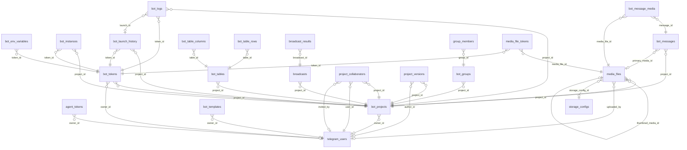

# Tables

| Name | Columns | Comment |
|------|---------|---------|
| [agent_tokens](./agent_tokens.md) | 10 | Таблица персональных токенов агента. Сам секрет НЕ хранится — только его sha-256 хеш. Токен несёт личность владельца, поэтому внешний клиент (MCP-сервер) работает только со своими проектами. |
| [app_settings](./app_settings.md) | 3 | Таблица настроек приложения в формате ключ-значение. Используется для хранения глобальных параметров конфигурации, например флага завершения мастера первоначальной настройки. |
| [bot_env_variables](./bot_env_variables.md) | 7 | Таблица пользовательских переменных окружения бота Хранит кастомные key=value переменные, привязанные к конкретному токену |
| [bot_groups](./bot_groups.md) | 24 | Таблица групп бота |
| [bot_instances](./bot_instances.md) | 9 | Таблица запущенных экземпляров ботов  ВАЖНО: После изменения этой схемы необходимо применить миграцию к базе данных! |
| [bot_launch_history](./bot_launch_history.md) | 8 | Таблица истории запусков ботов — накапливает все запуски |
| [bot_logs](./bot_logs.md) | 7 | Таблица логов ботов — хранит строки вывода stdout/stderr/status |
| [bot_message_media](./bot_message_media.md) | 6 | Таблица связи сообщений с медиафайлами |
| [bot_messages](./bot_messages.md) | 13 | Таблица истории сообщений между ботом и пользователями |
| [bot_projects](./bot_projects.md) | 18 | Таблица проектов ботов |
| [bot_table_columns](./bot_table_columns.md) | 4 | Таблица bot_table_columns — колонки пользовательской таблицы |
| [bot_table_rows](./bot_table_rows.md) | 4 | Таблица bot_table_rows — строки пользовательской таблицы (данные в JSONB) |
| [bot_tables](./bot_tables.md) | 4 | Таблица bot_tables — пользовательские таблицы проекта |
| [bot_templates](./bot_templates.md) | 28 | Таблица сценариев ботов |
| [bot_tokens](./bot_tokens.md) | 36 | Таблица токенов ботов |
| [bot_users](./bot_users.md) | 17 | Таблица пользователей бота |
| [broadcast_results](./broadcast_results.md) | 7 | Таблица результатов рассылки — по одной записи на каждого получателя |
| [broadcasts](./broadcasts.md) | 17 | Таблица рассылок — хранит задания на массовую отправку сообщений |
| [group_members](./group_members.md) | 18 | Таблица участников групп |
| [media_file_tokens](./media_file_tokens.md) | 5 | Таблица file_id медиафайла по токенам ботов (денормализация fileIdsByToken). Уникальность пары (медиафайл, токен) гарантирует один file_id на бота. |
| [media_files](./media_files.md) | 21 | Таблица медиафайлов |
| [project_collaborators](./project_collaborators.md) | 4 | Таблица коллабораторов проекта. Хранит связи между проектами и пользователями, имеющими доступ к ним. |
| [project_versions](./project_versions.md) | 8 | Таблица версий проектов — хранит снимки данных проекта (BotDataWithSheets) |
| [storage_configs](./storage_configs.md) | 8 | Таблица реестра хранилищ: несколько S3 (разные бакеты/endpoint'ы/креды) и несколько локальных папок. Одно хранилище помечено активным для новых загрузок; читать можно из всех. |
| [telegram_users](./telegram_users.md) | 8 | Таблица аутентифицированных пользователей Telegram |
| [user_ids](./user_ids.md) | 4 | Таблица ID пользователей для рассылки (общая база на все проекты) |
| [user_telegram_settings](./user_telegram_settings.md) | 9 | Таблица пользовательских настроек для Telegram Client API |
| [worker_processes](./worker_processes.md) | 8 | Таблица процессов воркеров — мониторинг Python worker pool |

---

## ER Diagram

