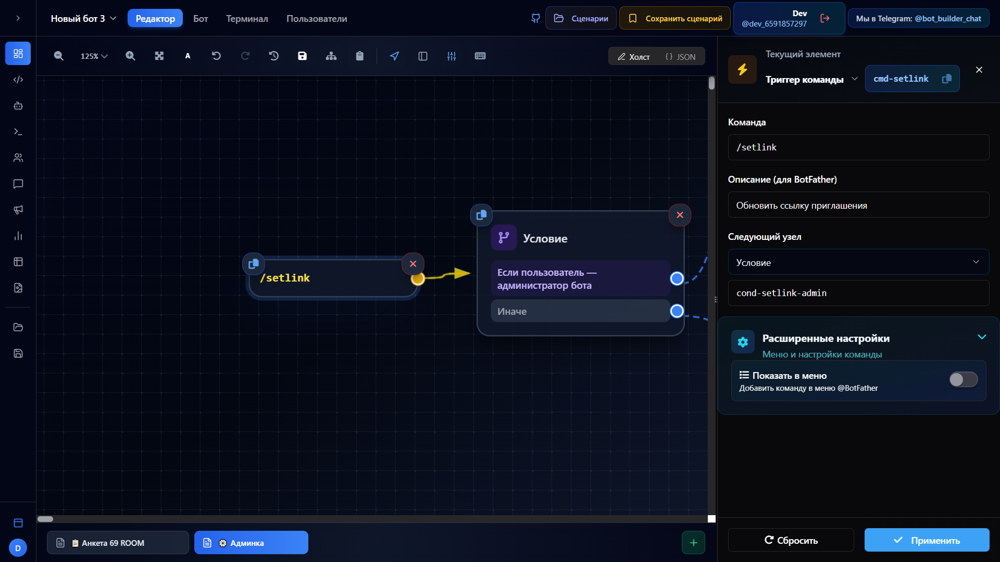

# Триггер команды (command_trigger)

Срабатывает когда пользователь отправляет боту команду — `/start`, `/help` или любую кастомную. Каждый узел command_trigger — это одна команда. Для нескольких команд используйте несколько узлов на холсте.

## Когда использовать

- Точка входа в бота (команда `/start`)
- Навигация по разделам (`/menu`, `/help`, `/settings`)
- Админские команды (`/stats`, `/broadcast`)
- Команды с ограниченным доступом (только для админов)

## Настройки

Доступны в UI (панель свойств):

| Поле | Описание | По умолчанию |
|------|----------|--------------|
| Команда | Текст команды, например `/start` | `/start` |
| Описание (для BotFather) | Отображается в списке команд Telegram | — |
| Показать в меню | Добавить команду в синюю кнопку «Меню» | `true` |
| Только для администраторов | Команда доступна только администраторам бота (`adminOnly`) | `false` |
| Требуется запуск бота | Команда доступна только пользователям, которые уже запускали бота (`/start`) (`requiresAuth`) | `false` |
| Следующий узел | Нода, к которой перейти после срабатывания (autoTransitionTo) | — |

## Как выглядит в редакторе



Справа — панель свойств: команда `/setlink`, описание для BotFather, следующий узел (condition), расширенные настройки.

## Deep Link (только для /start)

Если команда — `/start`, в панели свойств появляется секция **Deep Link**. Она позволяет обрабатывать переход пользователя по ссылке вида `t.me/bot?start=параметр`.

| Поле | Описание |
|------|----------|
| Режим совпадения | `exact` — точное совпадение, `startsWith` — начинается с |
| Параметр | Значение deep link для фильтрации (например `ref`) |
| Сохранить в переменную | Включить сохранение значения параметра |
| Имя переменной | Имя пользовательской переменной (например `referrer_id`) |

### Автоматический трекинг

При переходе по ссылке `t.me/bot?start=<args>`:

- Значение `args` автоматически сохраняется в переменную `{deep_link_param}`
- При прямом `/start` (без параметра) — `{deep_link_param}` = `"direct"`

Эти значения сохраняются только при первом визите и не перезаписываются.

Источники (deep_link_param) отображаются в графиках на вкладке «Аналитика» — можно отслеживать откуда приходят пользователи.

## Клавиатура

Кнопки задаются через отдельную **keyboard-ноду**, подключённую к узлу сообщения после триггера. Триггер команды не содержит кнопок напрямую.

## Примеры JSON

### Простой стартовый триггер

```json
{
  "id": "trigger_start",
  "type": "command_trigger",
  "position": { "x": 100, "y": 300 },
  "data": {
    "command": "/start",
    "description": "Запустить бота",
    "showInMenu": true,
    "autoTransitionTo": "welcome_message"
  }
}
```

### Команда с Deep Link фильтрацией

```json
{
  "id": "trigger_start_ref",
  "type": "command_trigger",
  "position": { "x": 100, "y": 300 },
  "data": {
    "command": "/start",
    "description": "Запустить бота",
    "showInMenu": true,
    "deepLinkMatchMode": "startsWith",
    "deepLinkParam": "ref_",
    "deepLinkSaveToVar": true,
    "deepLinkVarName": "referrer_id",
    "autoTransitionTo": "welcome_ref"
  }
}
```

## Связанные ноды

- [Триггер текста](./text-trigger.md) — для произвольного текста (не команд)
- [Сообщение](../actions/message.md) — обычно следует после триггера
- [Клавиатура](../actions/keyboard.md) — кнопки, подключаемые к сообщению
- [Условие](../logic/condition.md) — для ветвления по deep_link_param

---

*Техническая документация: [lib/templates/command-trigger](../../../lib/templates/command-trigger/command-trigger.md)*
